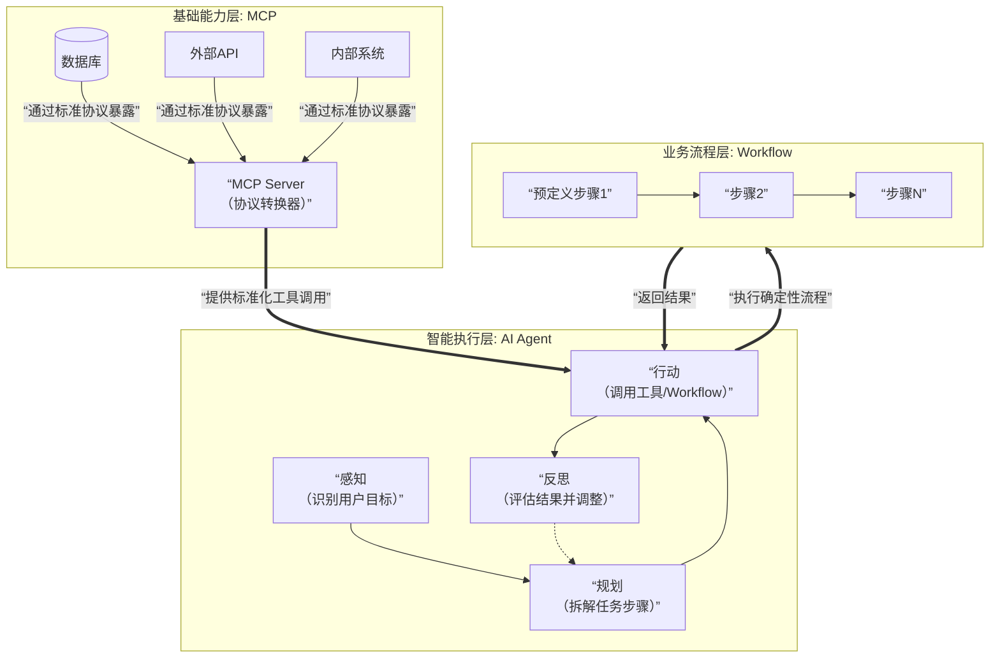

## AI Agent、Workflow和MCP的定义、作用与区别
好的，这是一个关于当前AI应用开发核心架构的绝佳问题。理解这三个概念，能帮你从“简单使用AI”上升到“系统化构建AI应用”的层面。

下面我为你清晰梳理AI Agent、Workflow和MCP的定义、作用与区别。

### **一、核心概念解读**

| 概念 | 本质比喻 | 核心定义 | 主要作用 |
| :--- | :--- | :--- | :--- |
| **🤖 AI Agent (智能体)** | **“自主的执行者”** | 一个能**感知环境、自主决策、执行动作**以达成目标的AI系统。它具备**规划、记忆、工具使用**等能力。 | 替代或辅助人类完成**多步骤、需判断的复杂任务**，如自主数据分析、客户服务、自动化编程等。 |
| **🔄 Workflow (工作流)** | **“预设的流水线”** | 一套**预先定义、结构化**的自动化业务流程。它由固定的步骤、规则和逻辑组成，按顺序或条件执行。 | 将**重复、规则明确**的业务过程自动化，提高效率与一致性，如文档审批、数据ETL、客户 onboarding。 |
| **🔌 MCP (模型上下文协议)** | **“模型的USB接口”** | 一个**开放协议**，用于将外部工具、数据源和服务安全、标准化地连接到大型语言模型。 | **打破AI模型的能力边界**，让其能实时获取信息、执行操作，如查询数据库、调用API、操作文件。 |

---

### **二、深度解析与相互关系**

#### **1. AI Agent：追求智能与自治**
- **核心特点**：**目标驱动**、**具备推理能力**（如Chain of Thought）、**可应对不确定性**。
- **关键组件**：
  - **规划器**：拆解目标，制定计划。
  - **记忆**：存储对话、知识、经验。
  - **工具集**：调用API、搜索等能力。
  - **执行与反思**：执行动作并根据结果调整策略。
- **示例**：一个“市场调研Agent”可以自动规划搜索关键词、爬取竞品信息、分析数据、生成报告，全程无需人工干预。

#### **2. Workflow：追求确定性与效率**
- **核心特点**：**过程驱动**、**结构固定**、**结果可预期**。
- **常见形态**：流程图、BPMN（业务流程建模符号）图。
- **示例**：一个“用户投稿审核Workflow”：投稿 → 自动查重 → 若重复率<10%则转编辑，否则拒绝 → 编辑审核 → 发布。**每一步都是预设好的。**

#### **3. MCP：为Agent和Workflow赋能的基础设施**
- **核心要解决的问题**：LLM本身是“闭口不言”的，无法主动获取最新信息或操作外部系统。MCP提供了标准的“插拔”方式。
- **工作原理**：MCP定义了一套**服务端（Server）和客户端（Client）** 的通信协议。服务端封装了工具能力，客户端（如Claude Desktop、Cursor IDE）遵循协议连接这些服务端，将工具暴露给模型。
- **示例**：通过MCP协议，你可以轻松让AI连接你的**公司知识库**、**Jira看板**或**GitHub仓库**，AI就能基于实时数据为你工作。

为了更直观地理解这三者如何在一个智能系统中协同，可以参考下面的架构图：

上图清晰地揭示了现代AI应用的分层架构：
- **MCP** 处于最底层，是**能力的提供者**，负责将一切资源标准化。
- **AI Agent** 处于核心层，是**智慧的调度者**，负责理解、规划和决策。
- **Workflow** 是**高效的执行者**，负责处理Agent规划中那些**确定、重复**的子任务。

---

### **三、核心区别与联系总结**

| 维度 | AI Agent | Workflow | MCP |
| :--- | :--- | :--- | :--- |
| **核心目标** | **完成复杂目标** | **自动化固定流程** | **连接模型与万物** |
| **驱动力** | 目标与智能推理 | 预定义规则与流程 | 标准化协议 |
| **灵活性** | **高**，可应对变化 | **低**，路径固定 | **不适用**，它是通道 |
| **关键技术** | LLM、规划算法、记忆网络 | 流程引擎、规则引擎 | API协议、认证、标准化 |
| **彼此关系** | **可以调用**Workflow作为其执行具体任务的一个可靠工具。 | **可以被**Agent触发和编排，作为其自动化流程的一部分。 | **为两者提供能力**。Agent和Workflow中的智能节点都通过MCP获取外部工具。 |

**一个生动的类比**：
想象你要装修房子（**复杂目标**）。
- **AI Agent** 就像是你的**全能项目经理**。他理解你的需求，制定计划（先拆旧，再水电...），协调各方，处理突发问题。
- **Workflow** 就像是**水电工的标准化施工手册**。只要按手册一步步做，就能可靠地完成水管铺设。
- **MCP** 就像是**项目经理和所有工人（水电工、木工）之间的标准对讲机协议**。有了它，项目经理才能准确地指挥每个工人使用他们的专业工具。