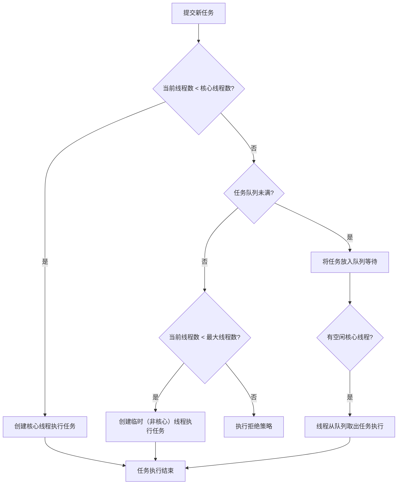

## Synchronized的实现原理
> “大家都知道 `synchronized` 是Java里的‘同步锁’，用它包裹的代码能保证线程安全。但你有没有想过，这个‘锁’到底长什么样？它被存在了哪里？为什么有的锁效率高，有的锁效率低？

### Synchronized的三种用法

首先，我们要明确`synchronized`可以锁在哪里，这是理解其原理的基础。

| 用法 | 示例 | 锁的对象 |
| :--- | :--- | :--- |
| **实例方法** | `public synchronized void method()` | **当前实例对象** (`this`) |
| **静态方法** | `public static synchronized void method()` | **当前类的Class对象** (如 `MyClass.class`) |
| **代码块** | `synchronized(obj) { ... }` | **括号里配置的对象** (`obj`) |

**核心概念：** 无论哪种用法，synchronized锁住的都是一个**Java对象**。

### JVM中的实现原理

这是内容的精髓，我们必须分层解析。

#### 层面一：字节码层面 —— `monitorenter` 与 `monitorexit`

我们可以通过一个清晰的流程图，来看当线程进入和退出同步块时，在字节码层面和JVM层面发生了什么：


当我们编译一个`synchronized`代码块时，编译器会在同步代码块的前后分别生成 `monitorenter` 和 `monitorexit` 指令。

- `monitorenter`：尝试**进入**并持有该对象的监视器。
- `monitorexit`：**释放**该对象的监视器。

**这两条指令的背后，是JVM与操作系统协同工作的结果。**

#### 层面二：对象头与Mark Word (锁的物理载体)

**锁实际上是存在每个Java对象的对象头里的。** 对象头主要包括两部分：

1.  **Mark Word**：存储对象自身的运行时数据，如**哈希码、GC分代年龄、锁状态标志**等。这是实现锁的关键！
2.  **Klass Pointer**：对象指向它的类型元数据的指针。

为了更直观地理解Mark Word如何作为锁信息的载体，下图展示了32位JVM下Mark Word在不同锁状态下的内存布局：

| 锁状态 | 25 bits | 4 bits | 1 bit | 2 bits | **对应“形态”说明** |
| :--- | :--- | :--- | :--- | :--- | :--- |
| **无锁 (可偏向)** | **`identity_hashcode`** | **`age`** | **`biased_lock=0`** | **`lock=01`** | 这是你给出的结构。此时对象未被锁定，但**允许偏向**。如果计算过hashCode，则25位用于存储。 |
| **偏向锁** | **`thread:23` + `epoch:2`** | **`age`** | **`biased_lock=1`** | **`lock=01`** | **形态改变！** 当有线程偏向时，23位存储线程ID，2位存储epoch，**原有的hashCode存储被覆盖**。 |
| **轻量级锁** | **`pointer_to_lock_record:30`** | | | **`lock=00`** | **形态彻底改变！** 30位指向线程栈帧中的锁记录指针。 |
| **重量级锁** | **`pointer_to_monitor:30`** | | | **`lock=10`** | **形态彻底改变！** 30位指向互斥量（monitor）的指针。 |
| **GC标记** | (已忽略) | | | **`lock=11`** | 被垃圾回收器标记时使用。 |

#### 层面三：锁的升级与优化

为了提高性能，JVM中的锁会从低开销到高开销进行升级。这个过程是不可逆的，目的就是为了减少直接使用重量级锁带来的性能损耗。

1.  **偏向锁**：
    - **目标**：解决在**没有竞争**情况下，同一个线程重复获取锁的性能开销。
    - **做法**：当第一个线程访问同步块时，会在Mark Word里记录自己的线程ID。以后该线程再进入和退出同步块时，不需要进行CAS操作来加锁和解锁，只需简单检查一下Mark Word里是否存储着自己的线程ID。

2.  **轻量级锁**：
    - **场景**：当有**轻微竞争**，另一个线程来尝试获取锁。
    - **做法**：JVM会在当前线程的栈帧中创建一个名为**锁记录**的空间，然后将对象头的Mark Word复制过去。然后，线程尝试用**CAS操作**将对象头的Mark Word替换为指向锁记录的指针。如果成功，当前线程获得锁；如果失败，表示有其他线程竞争，则**膨胀为重量级锁**。

3.  **重量级锁**：
    - **场景**：**竞争激烈**，轻量级锁自旋一定次数后依然无法获取锁。
    - **做法**：向操作系统申请**互斥量**。此时，未获取到锁的线程会被**挂起**，进入阻塞状态，等待操作系统调度唤醒。这个过程的成本最高，涉及到用户态到内核态的切换。

### 锁对比

| 锁类型 | 优点 | 缺点 | 适用场景 |
| :--- | :--- | :--- | :--- |
| **偏向锁** | 加锁解锁无需额外消耗 | 如果存在锁竞争，会带来额外的撤销消耗 | 只有一个线程访问同步块 |
| **轻量级锁** | 竞争的线程不会阻塞，响应快 | 始终得不到锁的线程，会自旋消耗CPU | 追求响应时间，同步块执行非常快 |
| **重量级锁** | 竞争激烈时，自旋的CPU消耗少 | 线程阻塞，响应时间缓慢 | 追求吞吐量，同步块执行时间较长 |

### 总结
> 关于synchronized的原理，从三个层面理解：
> 1. 字节码层面：依赖于monitorenter和monitorexit指令。
> 2. JVM层面：锁的具体信息存储在对象头的Mark Word中。
> 3. 锁优化层面：为了平衡性能，JVM设计了偏向锁、轻量级锁、重量级锁的升级过程，根据竞争激烈程度动态切换。”
> 
> “它的保证的可见性和有序性，是通过在解锁时必须将工作内存的变量刷回主内存，以及‘一个变量在同一时刻只允许一条线程对其进行lock操作’这条规则来实现的。”

## synchronized VS ReentrantLock 如何抉择
> “在JDK1.6之前，ReentrantLock在性能上对synchronized是碾压性的优势。但1.6之后，synchronized被重写了底层，加入了偏向锁、轻量级锁等优化，**两者在性能上已相差无几**。所以现在的抉择就不再是‘谁更快’，而是 **‘谁更能解决我的实际问题’** 。

### 核心差异对比

| 特性维度 | 🗝️ synchronized (JVM内置锁) | 🔌 ReentrantLock (API层面的锁) |
| :--- | :--- | :--- |
| **获取与释放** | **自动管理**。JVM负责在代码块入口和出口加锁、释放锁，不会遗忘。 | **手动管理**。必须显式调用 `lock()` 和 `unlock()`，易遗忘，需在 `finally` 中释放。 |
| **可中断性** | **不可中断**。线程若争抢不到锁，会一直阻塞，无法响应中断。 | **可中断**。提供了 `lockInterruptibly()` 方法，在等待锁时可以响应线程中断。 |
| **公平性** | **仅支持非公平锁**。 | **支持两者**。构造函数可传入 `true` 来创建公平锁，防止线程饥饿。 |
| **超时机制** | **不支持**。 | **支持**。`tryLock(long timeout, TimeUnit unit)` 可尝试获取锁，超时则放弃。 |
| **绑定条件** | **单一等待队列**。`wait()`/`notify()`/`notifyAll()` 随机唤醒。 | **多个Condition**。一个锁可以绑定多个条件队列，实现精确唤醒。 |
| **锁粒度** | 方法或代码块。 | 更灵活，锁的获取和释放可以跨越方法。 |
| **性能趋势** | JDK1.6后优化很好，在**低至中度竞争**下性能极佳。 | 在高竞争环境下，仍能保持稳定，提供了更丰富的**避免竞争**的手段。 |

### 核心优势场景深度解析

#### 1. 何时优先选择synchronized？

-   **场景一：追求开发效率与可靠性**
    -   **理由**：语法简洁，自动释放，无需担心因异常导致锁无法释放的问题。这是它**最核心的优势**。
    -   **代码对比**：
        ```java
        // synchronized: 简洁，可靠
        public synchronized void add() {
            // ... 业务逻辑
        }

        // ReentrantLock: 繁琐，需手动处理
        private ReentrantLock lock = new ReentrantLock();
        public void add() {
            lock.lock(); // 如果这里发生异常，锁还沒获取到
            try {
                // ... 业务逻辑
            } finally {
                lock.unlock(); // 必须放在finally块，确保锁释放
            }
        }
        ```

-   **场景二：绝大多数并发场景**
    -   **理由**：在大部分业务系统中，锁的竞争并不激烈。synchronized经过优化后，在这种情况下性能非常好，且JVM会自动进行锁升级/降级，无需开发者关心。

#### 2. 何时应考虑 ReentrantLock？

-   **场景一：需要应对“死等”风险 —— 可中断与超时**
    -   **案例**：一个转账服务，需要同时获取A锁和B锁。如果线程T1持有A等B，T2持有B等A，形成死锁。
    -   **synchronized方案**：无解，只能重启。
    -   **ReentrantLock方案**：使用 `tryLock` 进行尝试。
        ```java
        if (lockA.tryLock(1, TimeUnit.SECONDS)) { // 尝试获取锁A，等1秒
            try {
                if (lockB.tryLock(1, TimeUnit.SECONDS)) { // 尝试获取锁B，等1秒
                    try {
                        // ... 执行转账业务
                    } finally {
                        lockB.unlock();
                    }
                }
            } finally {
                lockA.unlock();
            }
        } else {
            // 记录日志，执行补偿逻辑，不会死锁
        }
        ```

-   **场景二：实现“先来后到” —— 公平锁**
    -   **案例**：一个票务系统，希望先请求的用户先买到票，避免某些用户一直抢不到（线程饥饿）。
    -   **解决方案**：使用 `new ReentrantLock(true)`。

-   **场景三：实现“分组唤醒” —— 条件变量 (Condition)**
    -   **经典案例：生产者-消费者模型**。我们希望生产者只唤醒消费者，消费者只唤醒生产者，而不是把所有等待线程都唤醒。
    -   **synchronized方案**：使用 `Object.wait()` 和 `Object.notifyAll()`，但 `notifyAll()` 会唤醒所有等待的生产者和消费者，效率低。
    -   **ReentrantLock方案**：使用两个Condition。
        ```java
        private ReentrantLock lock = new ReentrantLock();
        private Condition notFull = lock.newCondition();  // 队列未满条件
        private Condition notEmpty = lock.newCondition(); // 队列非空条件

        // 生产者
        public void put(Object item) throws InterruptedException {
            lock.lock();
            try {
                while (queue.isFull()) {
                    notFull.await(); // 在“未满”条件上等待
                }
                // ... 生产数据
                notEmpty.signal(); // 精准唤醒一个在“非空”条件上等待的消费者
            } finally {
                lock.unlock();
            }
        }
        // 消费者同理，使用notEmpty.await()和notFull.signal()
        ```

### 总结
> “**优先使用synchronized**。因为在JDK1.6优化后，它的性能已经不差，而且语法简单、由JVM自动管理，能有效减少编码错误。只有在需要synchronized无法提供的**高级功能**时，我才会考虑使用ReentrantLock，比如：
> 1.  **需要尝试获取锁**，用于解决死锁或苛刻的超时控制。
> 2.  **需要公平锁**，来处理线程饥饿问题。
> 3.  **需要可中断的锁**，让线程在等待时能响应外部中断。
> 4.  **需要绑定多个条件变量**，来实现线程间的精确通知，比如经典的生产者-消费者模型。”

## volatile是线程安全的吗
> “很多同学一看到 `volatile` 和‘线程’、‘变量’联系在一起，就下意识地认为它是线程安全的。**这是一个危险的误解！**
> 今天，我们就一起来彻底拆解 `volatile`：它能做什么，不能做什么，以及它的底层实现原理。”

先说结论：**volatile不是线程安全的**

首先，我们必须明确一个核心结论：**`volatile` 解决的是变量在多个线程间的‘可见性’问题，但它不保证复合操作的‘原子性’。**

为了更直观地理解它在并发安全中的独特定位，可以参考下面的“并发安全三要素”剖析图：


从上图可以清晰地看到，`volatile` 只解决了三要素中的“可见性”和部分“有序性”，但最关键的“原子性”它无法保证。因此，它本身**不是线程安全**的。

### 原理探秘：JMM与内存屏障

`volatile` 的实现原理，深植于 **Java内存模型** 之中。

#### 1. 可见性原理：绕过工作内存

-   **普通变量**：线程A从主内存读取变量到自己的工作内存，修改后，不一定立即写回主内存。线程B此时读取的可能是主内存中的旧值。
-   **volatile变量**：
    -   **写操作**：当写一个 `volatile` 变量时，JMM会**立即**将该线程对应的工作内存中的新值**强制刷新到主内存**中。
    -   **读操作**：当读一个 `volatile` 变量时，JMM会使该线程的工作内存中的缓存失效，从而**必须从主内存中重新读取**最新值。

#### 2. 有序性原理：内存屏障

为了实现可见性和禁止指令重排序，JVM在编译器和CPU级别使用了 **“内存屏障”**。你可以把内存屏障理解为一堵墙，告诉编译器和CPU：“屏障前的指令和屏障后的指令，不能乱序执行”。

对于 `volatile` 变量，JVM会在其读写操作前后插入特定的内存屏障：

| 场景 | 插入的屏障 | 作用 |
| :--- | :--- | :--- |
| **volatile 写** | StoreStore + StoreLoad | 确保**写前**的所有普通写操作都对其他线程可见；**写后**的指令不会被重排到写之前。 |
| **volatile 读** | LoadLoad + LoadStore | 确保**读后**的所有读/写操作都不会被重排到读之前。 |

正是这些内存屏障，保证了 `volatile` 的可见性和有序性。

### volatile的正确使用姿势

既然 `volatile` 不保证原子性，那它有什么用？它最适合用于**状态标志位**。

**✅ 正确示例：优雅地停止线程**
```java
public class MyThread extends Thread {
    // 使用volatile作为状态标志
    private volatile boolean stopped = false;

    public void run() {
        while (!stopped) { // 读volatile变量
            // ... 执行任务
        }
    }
    public void stopThread() {
        stopped = true; // 写volatile变量
    }
}
```
**为什么这是线程安全的？**
因为对 `stopped` 的操作是**单一的赋值操作**，本身具有原子性。`volatile` 在这里保证了当主线程调用 `stopThread()` 后，工作线程能**立即看到** `stopped` 变为 `true`，从而及时退出循环。

**❌ 错误示例：尝试用volatile做计数器**
```java
public class Counter {
    private volatile int count = 0;
    public void increment() {
        count++; // 这是一个“读-改-写”的复合操作，不是原子操作！
    }
    public int getCount() { return count; }
}
```
**为什么这是不安全的？**
`count++` 实际上包含三个步骤：
1.  读取 `count` 的当前值。
2.  将值加1。
3.  将新值写回 `count`。

假设两个线程同时执行到步骤1，它们可能读到相同的值，比如都是5，然后各自加1后写回，最终结果是6，而不是预期的7。`volatile` 在这里只能保证它们读到的都是最新值，但无法阻止这两个线程的步骤1-2-3交织在一起执行。

### 总结
> 关于volatile：
> 1.  **它不是线程安全的**。它只能保证**可见性**和**有序性**，但无法保证复合操作的**原子性**。
> 2.  它的底层原理是通过**内存屏障**实现的。在写操作时强制刷盘，在读操作时使缓存失效，并禁止指令重排序。
> 3.  它最经典的适用场景是作为一个**状态标志位**，比如安全地停止一个线程。但如果涉及到多个线程对同一个变量进行‘读-改-写’（如i++），则必须使用`synchronized`或`AtomicXXX`类。”

## 线程池核心参数与执行流程

### 核心参数

线程池通过 `ThreadPoolExecutor` 的构造函数来定制，必须理解以下7个参数：

```java
public ThreadPoolExecutor(
    int corePoolSize,      // 1. 核心线程数
    int maximumPoolSize,   // 2. 最大线程数
    long keepAliveTime,    // 3. 线程空闲存活时间
    TimeUnit unit,         // 4. 时间单位
    BlockingQueue<Runnable> workQueue, // 5. 任务队列
    ThreadFactory threadFactory,       // 6. 线程工厂
    RejectedExecutionHandler handler   // 7. 拒绝策略
)
```

| 参数名 | 作用 | 比喻与详解 |
| :--- | :--- | :--- |
| **`corePoolSize`** | **核心线程数** | 公司的**正式员工**。即使空闲，也不会被裁掉（除非设置 `allowCoreThreadTimeOut`）。 |
| **`maximumPoolSize`** | **最大线程数** | 公司**总人力上限**，等于正式工 + 临时工。 |
| **`keepAliveTime`** | **线程空闲存活时间** | **临时工**的合同期。超过这个时间没事干，就会被解雇。 |
| **`workQueue`** | **任务队列** | **待办事项列表**。核心员工都在忙时，新来的任务就排在这里等待。 |
| **`threadFactory`** | **线程工厂** | **HR部门**。负责给新线程（员工）“办入职”，可以统一设置线程名、优先级等。 |
| **`handler`** | **拒绝策略** | **当任务队列和临时工都满员时，HR如何拒绝新任务**。 |

---

### 任务提交流程

当调用 `execute(Runnable command)` 提交一个任务时，线程池内部遵循一套严格的决策流程。下面的流程图清晰地展示了这一过程，这是理解线程池行为的**灵魂**：



**流程要点解读：**
1.  **核心线程优先**：任务来时，先看能不能用核心线程（正式工）处理。
2.  **队列缓冲**：核心线程忙，**不是立即招临时工**，而是先让任务去排队。
3.  **临时线程扩容**：只有队列也满了，才会创建临时线程（数量不能超过最大线程数）。
4.  **拒绝保护**：队伍排满且人手招满，这时才启动拒绝策略。

**这是一个经典**的“**先核心 -> 再排队 -> 后扩容 -> 最后拒绝**”的保守资源管理策略，能有效防止在高负载下因过度创建线程而崩溃。

---

### 拒绝策略

当线程池和队列都满载时（即达到图中最后一步），由拒绝策略决定如何处置新任务。JDK内置了4种策略：

| 策略类 | 行为 | 适用场景 |
| :--- | :--- | :--- |
| **`AbortPolicy`** | **直接抛出 `RejectedExecutionException`** | **默认策略**。需要明确感知任务被拒绝时使用。 |
| **`CallerRunsPolicy`** | **让调用者线程自己执行任务** | 一种负反馈机制，能减缓任务提交速度，并保证任务不丢失。 |
| **`DiscardPolicy`** | **默默丢弃新任务，不抛异常** | 可容忍任务丢失的场景（不推荐）。 |
| **`DiscardOldestPolicy`** | **丢弃队列头部的旧任务，然后重试提交** | 允许丢弃旧任务，希望处理最新任务的场景。 |

**自定义拒绝策略**：你也可以实现 `RejectedExecutionHandler` 接口，将拒绝的任务持久化到数据库或消息队列，等待后续补偿。

---

### 面试精要与常见坑

**1. 经典面试题：为什么是先入队，而不是先创建最大线程？**
> **答**：这是一种**资源保护**的设计。创建线程是昂贵的操作（涉及系统调用）。队列缓冲能将突发的大量任务平摊到时间线上，利用核心线程逐步消化，避免短时间内创建大量线程耗尽资源。这符合“**池化**”思想的核心——复用与缓冲。

**2. 参数设置黄金经验（根据你的业务类型）：**
- **CPU密集型**（如计算、加密）：`corePoolSize` ≈ `CPU核数`。过多线程会导致频繁上下文切换。
- **IO密集型**（如网络、DB调用）：`corePoolSize` ≈ `CPU核数 * (1 + IO等待时间/CPU计算时间)`。通常可以设大一些，如 `2N` 到 `5N`。
- **队列选择**：
  - `LinkedBlockingQueue`：无界队列（需警惕内存溢出），适用于任务量平稳、不希望丢弃任务的场景。
  - `ArrayBlockingQueue`：有界队列，配合合理的拒绝策略，是**最常用的稳定模式**。
  - `SynchronousQueue`：不存储元素的队列，来一个任务就必须立刻有线程处理，适用于低延迟场景。

**3. 一个必须避开的坑：**
不要使用 `Executors.newFixedThreadPool()` 或 `newCachedThreadPool()` 等工厂方法，因为它们内部使用了**无界队列**或**最大线程数为Integer.MAX_VALUE**，在任务生产速度过快时，极易导致 **OOM**。**务必手动 `new ThreadPoolExecutor` 并根据业务设置明确的边界。**

## 什么是阻塞队列？说说常用的阻塞队列有哪些？
> 阻塞队列 BlockingQueue 继承 Queue ，是我们熟悉的基本数据结构队列的一种特殊类型。
> 
> 当从阻塞队列中获取数据时，如果队列为空，则等待直到队列有元素存入。当向阻塞队列中存入元素时，如果队列已满，则等待直到队列中有元素被移除。提供 offer()、put()、take()、poll() 等常用方法。

**JDK 提供的阻塞队列的实现有以下几种：**
1. **ArrayBlockingQueue：** 由数组实现的有界阻塞队列，该队列按照 FIFO 对元素进行排序。维护两个整形变量，标识队列头尾在数组中的位置，在生产者放入和消费者获取数据共用一个锁对象，意味着两者无法真正的并行运行，性能较低。
2. **LinkedBlockingQueue：** 由链表组成的有界阻塞队列，如果不指定大小，默认使用 Integer.MAX_VALUE 作为队列大小，该队列按照 FIFO 对元素进行排序，对生产者和消费者分别维护了独立的锁来控制数据同步，意味着该队列有着更高的并发性能。
3. **SynchronousQueue：** 不存储元素的阻塞队列，无容量，可以设置公平或非公平模式，插入操作必须等待获取操作移除元素，反之亦然。
4. **PriorityBlockingQueue：** 支持优先级排序的无界阻塞队列，默认情况下根据自然序排序，也可以指定 Comparator
5. **DelayQueue：** 支持延时获取元素的无界阻塞队列，创建元素时可以指定多久之后才能从队列中获取元素，常用于缓存系统或定时任务调度系统。
6. **LinkedTransferQueue：** 一个由链表结构组成的无界阻塞队列，与 LinkedBlockingQueue 相比多了 transfer 和 tryTranfer 方法，该方法在有消费者等待接收元素时会立即将元素传递给消费者。
7. **LinkedBlockingDeque：** 一个由链表结构组成的双端阻塞队列，可以从队列的两端插入和删除元素


## 介绍什么是ThreadLocal，以及为什么会有内存泄露风险
### ThreadLocal介绍
为了解决“在多线程下访问共享变量时，存在的并发问题”，我们可以使用同步机制（如: `synchronized`）, 同时也可以使用`ThreadLocal`。`ThreadLocal` 提供了一个“每个线程都有自己的专属变量”的机制，避免了多线程环境下共享变量的并发问题。通过`ThreadLocal`的`set`方法可以看出来。`ThreadLocal`通过`Map`结构来存储数据，Key就是当前线程，Value就是存储的数据。
```java
public void set(T value) {
    Thread t = Thread.currentThread();
    ThreadLocalMap map = getMap(t);
    if (map != null) {
        map.set(this, value);
    } else {
        createMap(t, value)
    }
}
```
基本用法如下：
```java
public class ThreadLocalExample {
    // 存储用户信息
    private static final ThreadLocal<User> CURRENT_USER = new ThreadLocal<>();

    public void setCurrentUser(User user) {
        CURRENT_USER.set(user); // 将用户信息绑定到当前线程
    }

    public User getCurrentUser() {
        return CURRENT_USER.get(); // 从当前线程获取用户信息
    }

    public void clearCurrentUser() {
        CURRENT_USER.remove(); // 重要！使用完后清理，防止内存泄漏
    }
}
```
### 为什么存在内存泄露（Memory Leak）风险
这就要理解上文提到的`ThreadLocal`使用的`Map`结构了，源码如下：
```java
static class ThreadLocalMap {
  static class Entry extends WeakReference<ThreadLocal<?>> {
        /** The value associated with this ThreadLocal. */
        Object value; // 注意这里的value依然是强引用

        Entry(ThreadLocal<?> k, Object v) {
            super(k);
            value = v;
        }
    }
}
```
ThreadLocalMap 中的 Entry：
- **Key：** 是一个弱引用，指向 threadLocal 实例。
- **Value：** 是一个强引用，指向设置的数据实例。

> 想了解强引用和弱引用，可以参考[ Java基础](../java/base.md) 中“什么是强引用、软引用、弱引用、虚引用”相关内容。

当程序使用完`ThreadLocal`并且正确释放(例如调用`remove()`方法)，是不会出现内存泄露风险的。但是如果创建 ThreadLocal 的强引用一直存在，或者线程迟迟不结束（例如使用线程池，线程会复用且长期存活），那么弱引用就失去了其加速回收的关键作用。

此时：引用链变成了一个强引用链，导致无法回收：
> Thread A (强引用) -> ThreadA.threadLocals (强引用) -> Entry (强引用) -> Entry.value (强引用) -> 数据实例

即使你的业务代码已经不再需要这个 数据实例，但由于这条强引用链的存在，只要线程 ThreadA 依然存在，这个 数据实例 就会一直驻留在内存中，造成内存泄露。如果线程池中每个线程都这么存一个大数据对象，最终可能导致 OutOfMemoryError。

**所以存在内存泄露风险的原因是：**
1. `ThreadLocalMap` 的Entry中，Key是弱引用，但Value是强引用
2. 线程生命周期过长，导致强引用一致存在，无法被GC回收
3. 未及时调用`remove()`方法