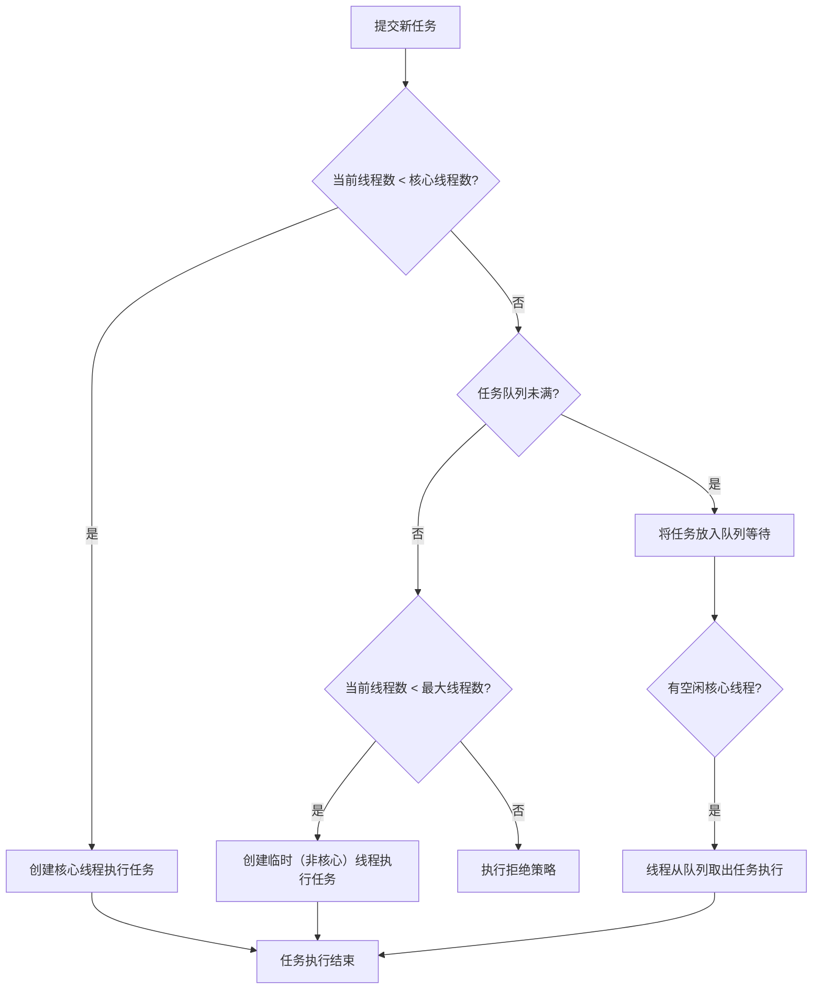

## 线程池核心参数与执行流程

### 核心参数

线程池通过 `ThreadPoolExecutor` 的构造函数来定制，必须理解以下7个参数：

```java
public ThreadPoolExecutor(
    int corePoolSize,      // 1. 核心线程数
    int maximumPoolSize,   // 2. 最大线程数
    long keepAliveTime,    // 3. 线程空闲存活时间
    TimeUnit unit,         // 4. 时间单位
    BlockingQueue<Runnable> workQueue, // 5. 任务队列
    ThreadFactory threadFactory,       // 6. 线程工厂
    RejectedExecutionHandler handler   // 7. 拒绝策略
)
```

| 参数名 | 作用 | 比喻与详解 |
| :--- | :--- | :--- |
| **`corePoolSize`** | **核心线程数** | 公司的**正式员工**。即使空闲，也不会被裁掉（除非设置 `allowCoreThreadTimeOut`）。 |
| **`maximumPoolSize`** | **最大线程数** | 公司**总人力上限**，等于正式工 + 临时工。 |
| **`keepAliveTime`** | **线程空闲存活时间** | **临时工**的合同期。超过这个时间没事干，就会被解雇。 |
| **`workQueue`** | **任务队列** | **待办事项列表**。核心员工都在忙时，新来的任务就排在这里等待。 |
| **`threadFactory`** | **线程工厂** | **HR部门**。负责给新线程（员工）“办入职”，可以统一设置线程名、优先级等。 |
| **`handler`** | **拒绝策略** | **当任务队列和临时工都满员时，HR如何拒绝新任务**。 |

---

### 任务提交流程

当调用 `execute(Runnable command)` 提交一个任务时，线程池内部遵循一套严格的决策流程。下面的流程图清晰地展示了这一过程，这是理解线程池行为的**灵魂**：



**流程要点解读：**
1.  **核心线程优先**：任务来时，先看能不能用核心线程（正式工）处理。
2.  **队列缓冲**：核心线程忙，**不是立即招临时工**，而是先让任务去排队。
3.  **临时线程扩容**：只有队列也满了，才会创建临时线程（数量不能超过最大线程数）。
4.  **拒绝保护**：队伍排满且人手招满，这时才启动拒绝策略。

**这是一个经典**的“**先核心 -> 再排队 -> 后扩容 -> 最后拒绝**”的保守资源管理策略，能有效防止在高负载下因过度创建线程而崩溃。

---

### 拒绝策略

当线程池和队列都满载时（即达到图中最后一步），由拒绝策略决定如何处置新任务。JDK内置了4种策略：

| 策略类 | 行为 | 适用场景 |
| :--- | :--- | :--- |
| **`AbortPolicy`** | **直接抛出 `RejectedExecutionException`** | **默认策略**。需要明确感知任务被拒绝时使用。 |
| **`CallerRunsPolicy`** | **让调用者线程自己执行任务** | 一种负反馈机制，能减缓任务提交速度，并保证任务不丢失。 |
| **`DiscardPolicy`** | **默默丢弃新任务，不抛异常** | 可容忍任务丢失的场景（不推荐）。 |
| **`DiscardOldestPolicy`** | **丢弃队列头部的旧任务，然后重试提交** | 允许丢弃旧任务，希望处理最新任务的场景。 |

**自定义拒绝策略**：你也可以实现 `RejectedExecutionHandler` 接口，将拒绝的任务持久化到数据库或消息队列，等待后续补偿。

---

### 面试精要与常见坑

**1. 经典面试题：为什么是先入队，而不是先创建最大线程？**
> **答**：这是一种**资源保护**的设计。创建线程是昂贵的操作（涉及系统调用）。队列缓冲能将突发的大量任务平摊到时间线上，利用核心线程逐步消化，避免短时间内创建大量线程耗尽资源。这符合“**池化**”思想的核心——复用与缓冲。

**2. 参数设置黄金经验（根据你的业务类型）：**
- **CPU密集型**（如计算、加密）：`corePoolSize` ≈ `CPU核数`。过多线程会导致频繁上下文切换。
- **IO密集型**（如网络、DB调用）：`corePoolSize` ≈ `CPU核数 * (1 + IO等待时间/CPU计算时间)`。通常可以设大一些，如 `2N` 到 `5N`。
- **队列选择**：
  - `LinkedBlockingQueue`：无界队列（需警惕内存溢出），适用于任务量平稳、不希望丢弃任务的场景。
  - `ArrayBlockingQueue`：有界队列，配合合理的拒绝策略，是**最常用的稳定模式**。
  - `SynchronousQueue`：不存储元素的队列，来一个任务就必须立刻有线程处理，适用于低延迟场景。

**3. 一个必须避开的坑：**
不要使用 `Executors.newFixedThreadPool()` 或 `newCachedThreadPool()` 等工厂方法，因为它们内部使用了**无界队列**或**最大线程数为Integer.MAX_VALUE**，在任务生产速度过快时，极易导致 **OOM**。**务必手动 `new ThreadPoolExecutor` 并根据业务设置明确的边界。**

## 介绍什么是ThreadLocal，以及为什么会有内存泄露风险

### ThreadLocal介绍
为了解决“在多线程下访问共享变量时，存在的并发问题”，我们可以使用同步机制（如: `synchronized`）, 同时也可以使用`ThreadLocal`。`ThreadLocal` 提供了一个“每个线程都有自己的专属变量”的机制，避免了多线程环境下共享变量的并发问题。通过`ThreadLocal`的`set`方法可以看出来。`ThreadLocal`通过`Map`结构来存储数据，Key就是当前线程，Value就是存储的数据。
```java
public void set(T value) {
    Thread t = Thread.currentThread();
    ThreadLocalMap map = getMap(t);
    if (map != null) {
        map.set(this, value);
    } else {
        createMap(t, value)
    }
}
```
基本用法如下：
```java
public class ThreadLocalExample {
    // 存储用户信息
    private static final ThreadLocal<User> CURRENT_USER = new ThreadLocal<>();

    public void setCurrentUser(User user) {
        CURRENT_USER.set(user); // 将用户信息绑定到当前线程
    }

    public User getCurrentUser() {
        return CURRENT_USER.get(); // 从当前线程获取用户信息
    }

    public void clearCurrentUser() {
        CURRENT_USER.remove(); // 重要！使用完后清理，防止内存泄漏
    }
}
```
### 为什么存在内存泄露（Memory Leak）风险
这就要理解上文提到的`ThreadLocal`使用的`Map`结构了，源码如下：
```java
static class ThreadLocalMap {
  static class Entry extends WeakReference<ThreadLocal<?>> {
        /** The value associated with this ThreadLocal. */
        Object value; // 注意这里的value依然是强引用

        Entry(ThreadLocal<?> k, Object v) {
            super(k);
            value = v;
        }
    }
}
```
ThreadLocalMap 中的 Entry：
- **Key：** 是一个弱引用，指向 threadLocal 实例。
- **Value：** 是一个强引用，指向设置的数据实例。

> 想了解强引用和弱引用，可以参考[ Java基础](../java/base.md) 中“什么是强引用、软引用、弱引用、虚引用”相关内容。

当程序使用完`ThreadLocal`并且正确释放(例如调用`remove()`方法)，是不会出现内存泄露风险的。但是如果创建 ThreadLocal 的强引用一直存在，或者线程迟迟不结束（例如使用线程池，线程会复用且长期存活），那么弱引用就失去了其加速回收的关键作用。

此时：引用链变成了一个强引用链，导致无法回收：
> Thread A (强引用) -> ThreadA.threadLocals (强引用) -> Entry (强引用) -> Entry.value (强引用) -> 数据实例

即使你的业务代码已经不再需要这个 数据实例，但由于这条强引用链的存在，只要线程 ThreadA 依然存在，这个 数据实例 就会一直驻留在内存中，造成内存泄露。如果线程池中每个线程都这么存一个大数据对象，最终可能导致 OutOfMemoryError。

**所以存在内存泄露风险的原因是：**
1. `ThreadLocalMap` 的Entry中，Key是弱引用，但Value是强引用
2. 线程生命周期过长，导致强引用一致存在，无法被GC回收
3. 未及时调用`remove()`方法